# ToyShop

ToyShop is a full-stack web application for managing a toy rental and sales store. It features a modern React frontend and a Node.js/Express backend with MongoDB, providing a complete workflow for customers and administrators.

## User View:

<details>
<summary>Click to view screenshots</summary>

**Home Page**
<br>
<a href="images/image.png" target="_blank">
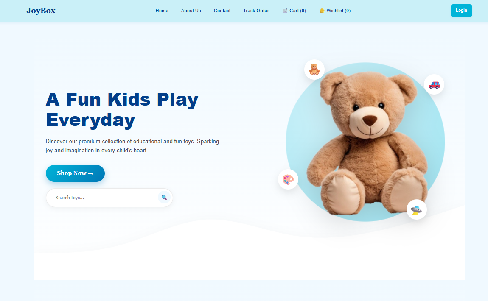
</a>

**Category Page**
<br>
<a href="images/image-1.png" target="_blank">
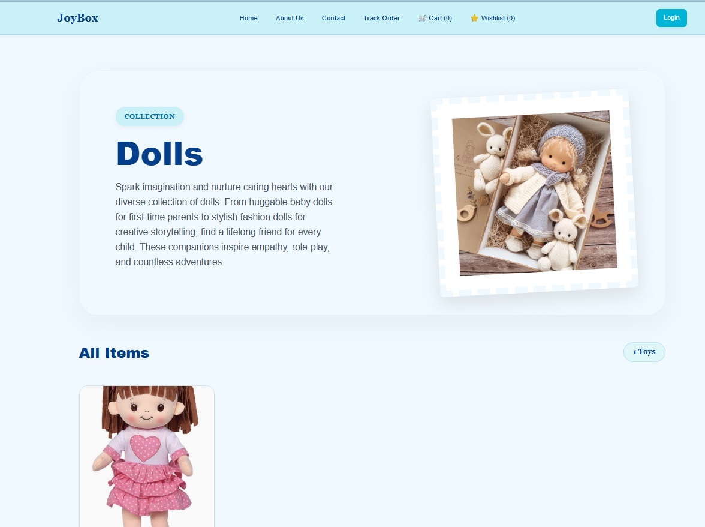
</a>

**Toy Details**
<br>
<a href="images/image-20.png" target="_blank">
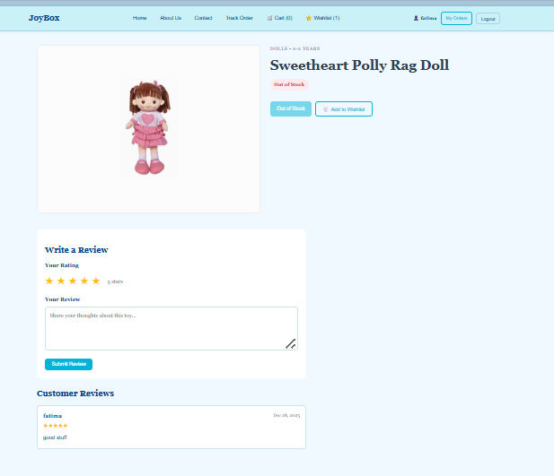
</a>

**About Page**
<br>
<a href="images/image-2.png" target="_blank">
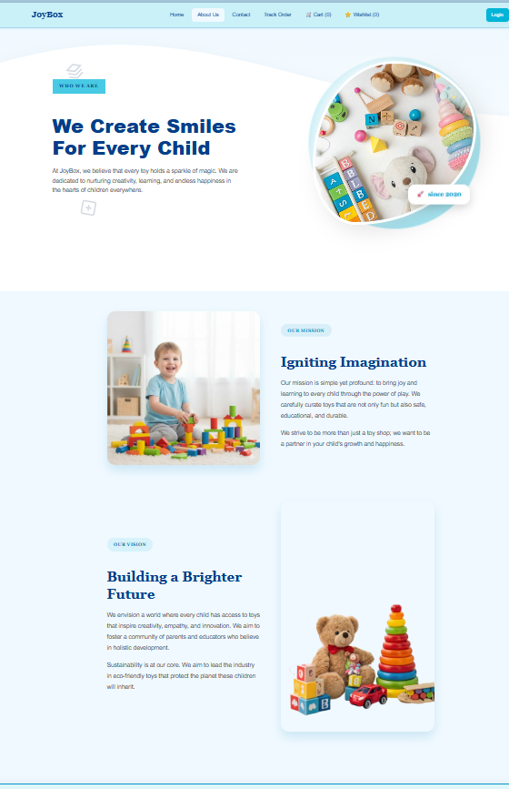
</a>

**Contact Page**
<br>
<a href="images/image-3.png" target="_blank">

</a>

**Wishlist**
<br>
<a href="images/image-4.png" target="_blank">
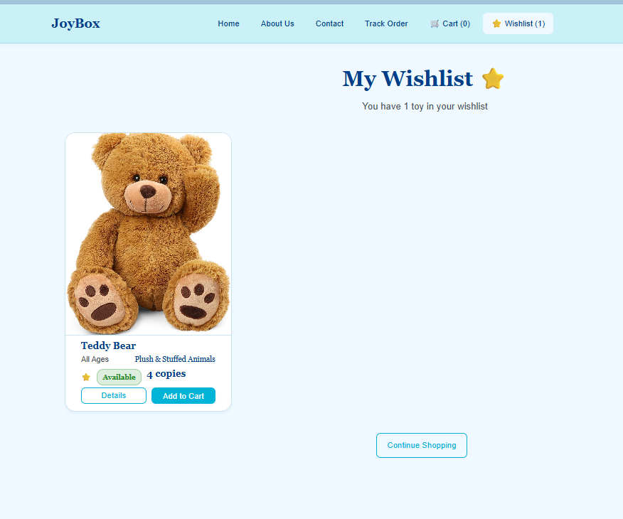
</a>

**Gift Wrapping**
<br>
<a href="images/image-5.png" target="_blank">
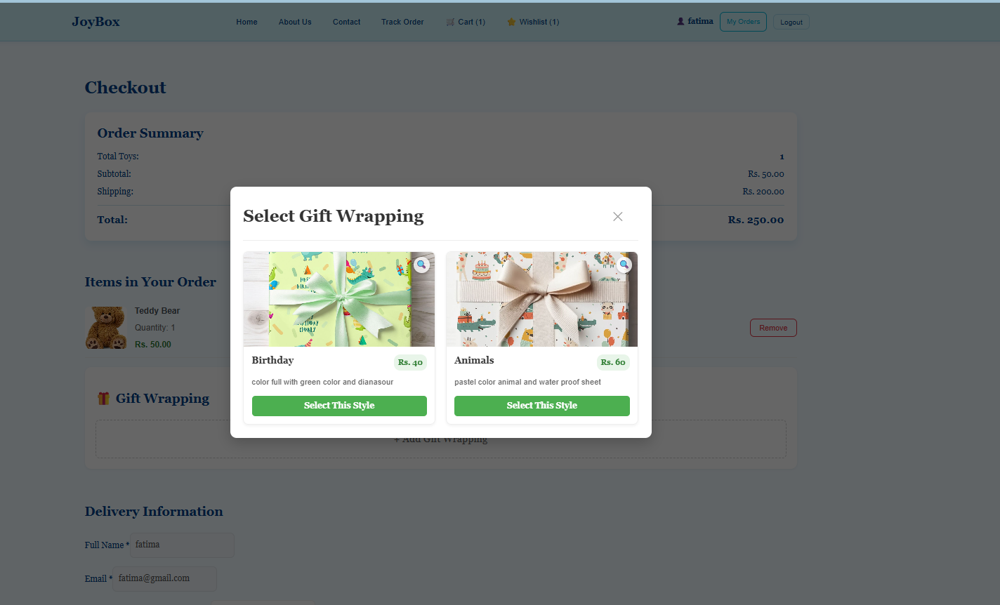
</a>

**Checkout**
<br>
<a href="images/image-6.png" target="_blank">
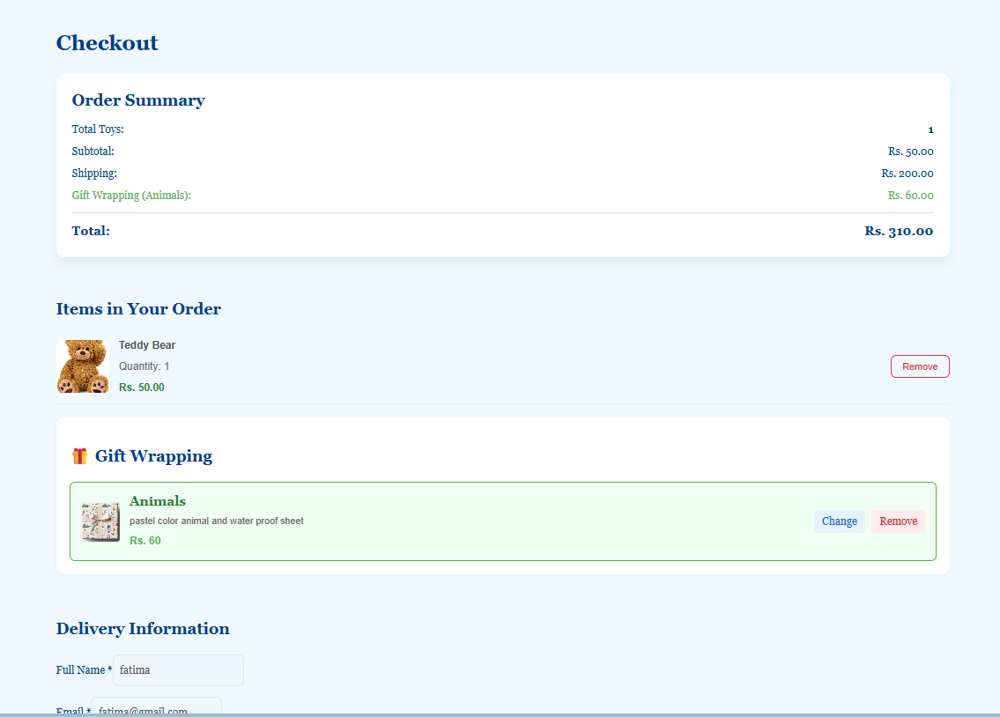
</a>

**Success Screen**
<br>
<a href="images/image-7.png" target="_blank">
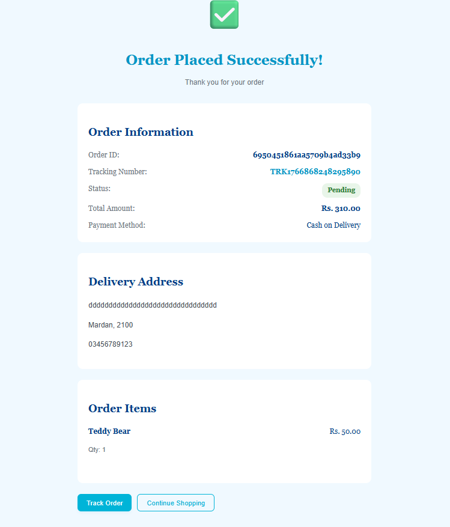
</a>

**Order Tracking**
<br>
<a href="images/image-9.png" target="_blank">

</a>

**Order Status**
<br>
<a href="images/image-8.png" target="_blank">
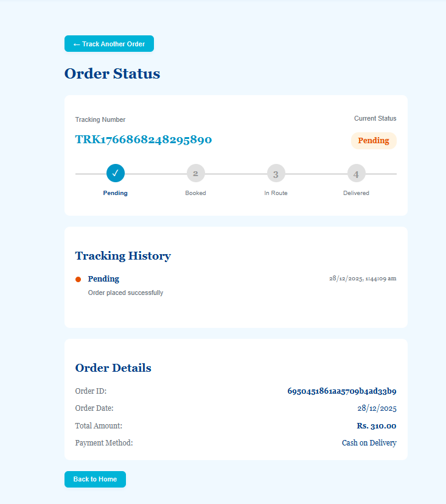
</a>

**Shopping Cart**
<br>
<a href="images/image-10.png" target="_blank">
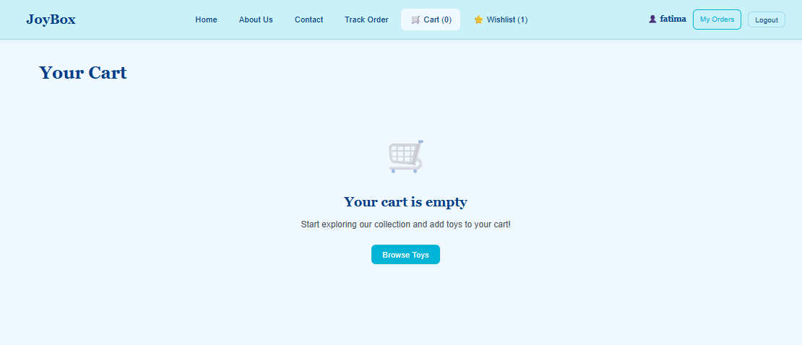
</a>

**My Orders**
<br>
<a href="images/image-11.png" target="_blank">
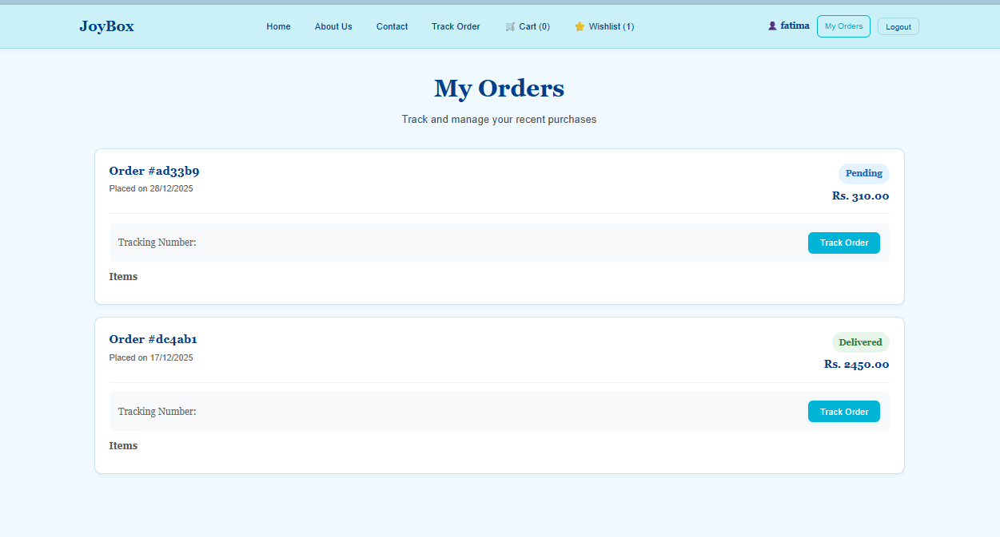
</a>

</details>

## Admin Dashboard:

<details>
<summary>Click to view admin screenshots</summary>

**Reports**
<br>
<a href="images/image-12.png" target="_blank">
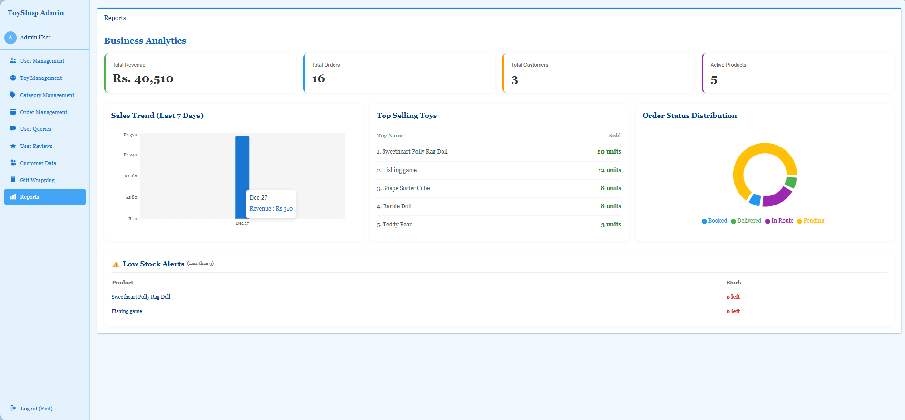
</a>

**Gift Wrapping Management**
<br>
<a href="images/image-13.png" target="_blank">
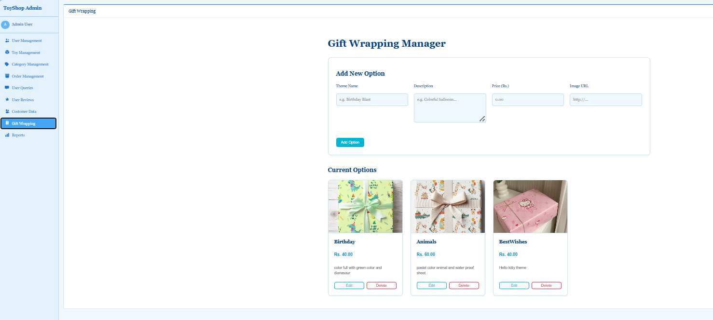
</a>

**Reviews Management**
<br>
<a href="images/image-14.png" target="_blank">
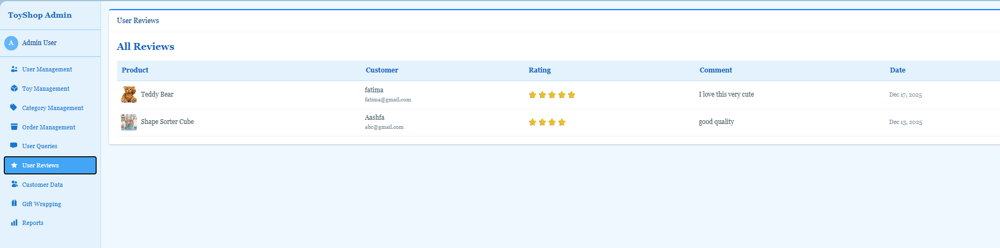
</a>

**Queries Management**
<br>
<a href="images/image-15.png" target="_blank">
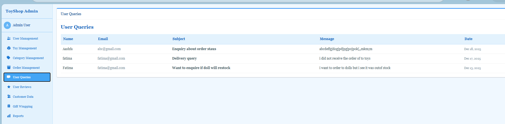
</a>

**Orders Management**
<br>
<a href="images/image-16.png" target="_blank">
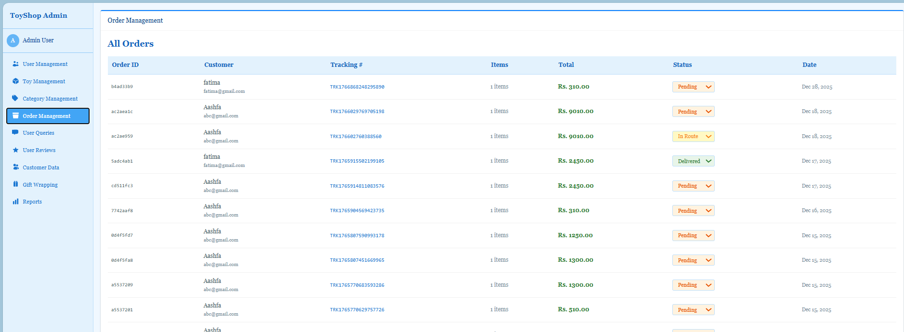
</a>

**Categories Management**
<br>
<a href="images/image-17.png" target="_blank">
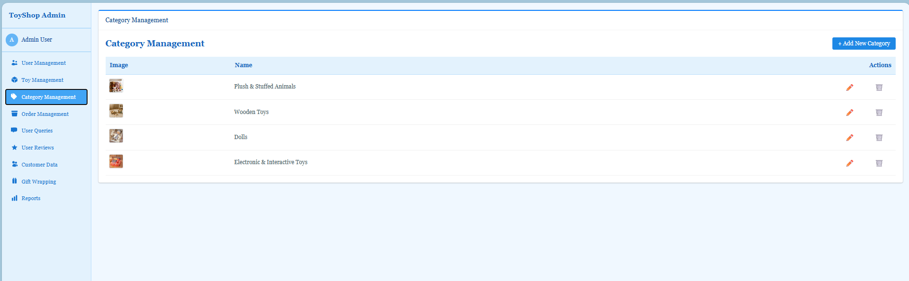
</a>

**Toy Management**
<br>
<a href="images/image-18.png" target="_blank">
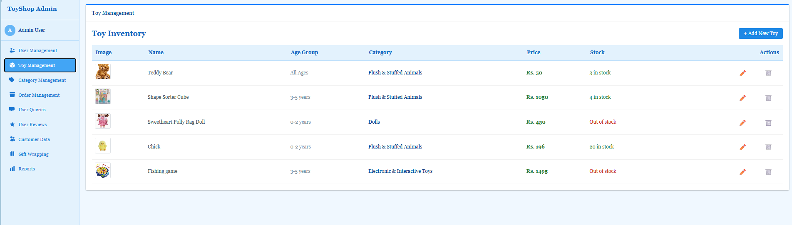
</a>

**User Management**
<br>
<a href="images/image-19.png" target="_blank">
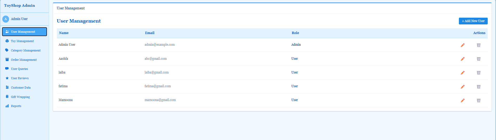
</a>

</details>

## Features

### Customer Features

- Browse toys by category and age group
- View detailed toy information and reviews
- Register and log in as a customer
- Add toys to cart and wishlist
- Checkout and place orders
- Track order status
- Submit queries and write reviews

### Admin Features

- Manage users (add, edit, delete)
- Manage toys (add, edit, delete, update stock)
- Manage categories
- Manage orders and update order status
- Manage gift wrapping options
- View business analytics and reports

## Tech Stack

- **Frontend:** React, Vite, Context API, modern CSS
- **Backend:** Node.js, Express, MongoDB (Mongoose)
- **Other:** JWT authentication, RESTful APIs

## Project Structure

```
toyshop/
	backend/
		models/
		controllers/
		routes/
		config/
		server.js
		...
	frontend/
		src/
			components/
			pages/
			context/
			utils/
		public/
		...
	docs/
	README.md
```

## Setup Instructions

### Backend

1. Install dependencies:
   ```bash
   cd backend
   npm install
   ```
2. Set up your `.env` file (see `backend/config/db.js` for required variables).
3. Start the backend server:
   ```bash
   npm start
   ```

### Frontend

1. Install dependencies:
   ```bash
   cd frontend
   npm install
   ```
2. Start the frontend dev server:
   ```bash
   npm run dev
   ```

## Usage

- Visit the frontend at `http://localhost:5173` (or as shown in your terminal).
- The backend runs on `http://localhost:5000` by default.
- Register as a user or log in as admin to access management features.

## Contributing

Pull requests are welcome. For major changes, please open an issue first to discuss what you would like to change.

## License

This project is for educational purposes.
